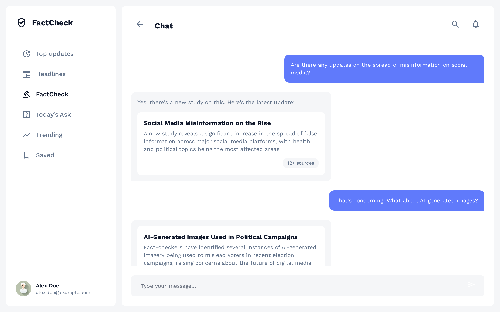
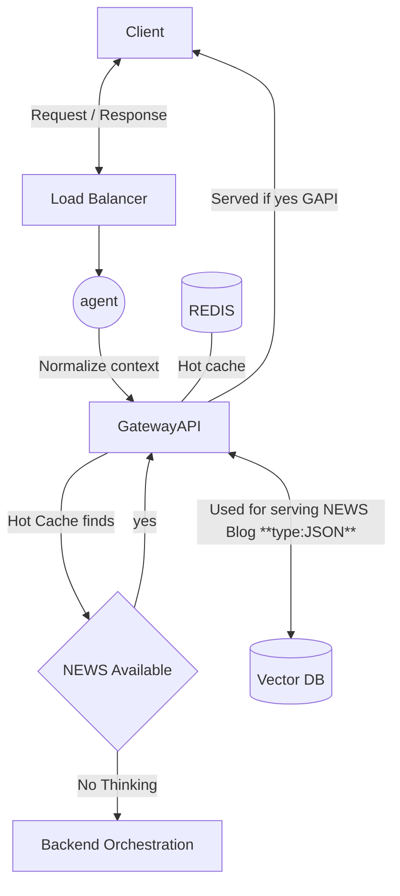
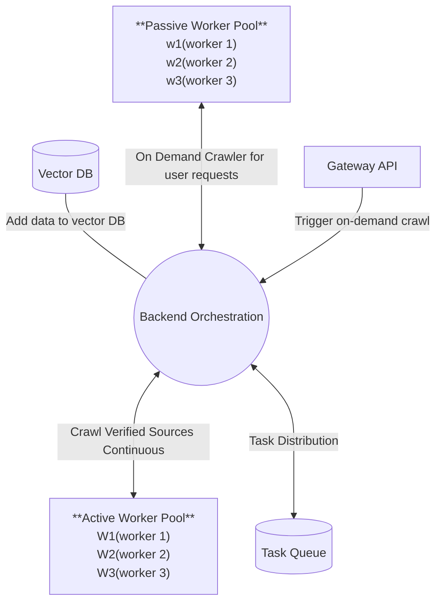

## Frontend 




## Backend Crawler and Orchestration

### Overview

This system is a distributed news/blog crawler and orchestration platform that provides real-time content aggregation with intelligent caching and vector-based search capabilities. The architecture separates concerns between client-facing services, data storage, and background processing workers.

---

### Architecture Components

#### 1. **Load Balancer (LB)**
- Distributes incoming client requests across multiple Gateway API instances
- Provides high availability and load distribution
- Health checks and failover capabilities

#### 2. **Agent (AI)**
- Normalizes and processes client requests
- Uses LLM (Ollama with Qwen2.5:7b-instruct) to understand context
- Transforms user queries into structured search requests
- Acts as an intelligent request preprocessor

#### 3. **Gateway API (GAPI)**
- Primary interface for serving news/blog content
- Implements multi-tier caching strategy:
  - **Hot Cache (Redis)**: Fast in-memory cache for frequently accessed content
  - **Vector DB**: Semantic search for content retrieval
- Returns data in JSON format
- Triggers backend orchestration when content is not available

#### 4. **Redis (Hot Cache)**
- In-memory key-value store for frequently accessed news items
- Reduces latency for popular queries
- Cache invalidation strategies for data freshness
- TTL-based expiration for automatic cache management

#### 5. **Vector Database**
- Stores news/blog articles as embeddings
- Enables semantic search and similarity matching
- Supports JSON document storage with vector indices
- Used for serving content when not in hot cache

#### 6. **Backend Orchestration (BO)**
- Central coordinator for all crawling operations
- Manages worker pools (Active and Passive)
- Handles task distribution and load balancing
- Processes and ingests crawled data into Vector DB
- Monitors worker health and manages failures

---

### Client Serving Flowchart



#### Request Flow Explanation

1. **Client Request**: User sends a request through the Load Balancer
2. **Agent Processing**: LLM agent normalizes and understands the request context
3. **Gateway API Check**: 
   - First checks Redis hot cache for instant results
   - If found, serves immediately to client
4. **Cache Miss Handling**:
   - If not in hot cache, queries Vector DB
   - If found in Vector DB, serves to client and optionally updates hot cache
5. **Orchestration Trigger**: 
   - If content not available, triggers Backend Orchestration
   - Passive workers are dispatched to fetch requested content
   - Results are stored in Vector DB and hot cache for future requests

---

### Backend Orchestration Flow Chart



---

### Backend Orchestration: Detailed Architecture

#### Core Responsibilities

The Backend Orchestration system is the **brain** of the crawling infrastructure. It coordinates all background operations and ensures efficient resource utilization.

##### 1. **Worker Pool Management**

###### Active Workers (Continuous Crawling)
- **Purpose**: Proactively crawl verified news sources on a scheduled basis
- **Operation Mode**: 
  - Run continuously in the background
  - Follow predefined crawl schedules (e.g., every 15 minutes, hourly)
  - Monitor RSS feeds, sitemaps, and API endpoints
- **Source Management**:
  - Maintains a list of verified, trusted news sources
  - Each worker assigned to specific sources or categories
  - Rotates through sources to prevent rate limiting
- **Data Flow**:
  ```
  Active Worker → Crawl Source → Extract Content → 
  Process & Normalize → Send to Orchestrator → Store in Vector DB
  ```
- **Benefits**:
  - Pre-populates database with fresh content
  - Reduces latency for common queries
  - Ensures data freshness

###### Passive Workers (On-Demand Crawling)
- **Purpose**: Handle specific user requests for content not in the system
- **Operation Mode**:
  - Idle until triggered by Gateway API
  - Activated when cache miss occurs and content not in Vector DB
  - Process ad-hoc crawl requests
- **Task Types**:
  - Single URL crawling
  - Search query-based crawling
  - Custom source crawling
- **Data Flow**:
  ```
  Gateway API → Orchestrator → Task Queue → Passive Worker → 
  Crawl Requested Source → Process → Store in Vector DB → 
  Update Hot Cache → Return to Gateway API
  ```
- **Benefits**:
  - Handles edge cases and new sources
  - Provides real-time content for specific queries
  - Efficient resource usage (only active when needed)

##### 2. **Task Queue System**

The orchestrator uses a task queue (e.g., Redis Queue, Celery, or RabbitMQ) to:
- **Distribute Tasks**: Assign crawl jobs to available workers
- **Load Balancing**: Distribute work evenly across worker pool
- **Priority Management**: Prioritize user requests over scheduled crawls
- **Retry Logic**: Handle failed crawls with exponential backoff
- **Task Tracking**: Monitor task status and completion

##### 3. **Data Processing Pipeline**

```
Raw Content → Content Extraction → Text Cleaning → 
Embedding Generation → Metadata Extraction → 
Deduplication Check → Vector DB Storage → Cache Update
```

**Steps**:
1. **Content Extraction**: Parse HTML, extract article text, images, metadata
2. **Text Cleaning**: Remove ads, navigation, normalize whitespace
3. **Embedding Generation**: Create vector embeddings using LLM (Qwen2.5)
4. **Metadata Extraction**: Extract title, author, date, category, tags
5. **Deduplication**: Check if article already exists (hash-based or similarity)
6. **Storage**: Insert into Vector DB with embeddings and metadata
7. **Cache Update**: Optionally update Redis hot cache for popular content

##### 4. **Worker Health Monitoring**

- **Heartbeat System**: Workers send periodic health signals
- **Failure Detection**: Detect crashed or unresponsive workers
- **Auto-Recovery**: Restart failed workers or redistribute tasks
- **Resource Monitoring**: Track CPU, memory, network usage
- **Rate Limiting**: Monitor and enforce crawl rate limits per source

##### 5. **Source Management**

- **Verified Sources List**: Maintains database of trusted news sources
- **Crawl Schedules**: Configurable intervals per source (respects robots.txt)
- **Rate Limiting**: Respects source-specific rate limits
- **Source Health**: Tracks source availability and response times
- **Dynamic Source Addition**: Ability to add new sources without restart

---

### Credibility-Based Source Management

#### Source Classification

The system uses a **two-tier source classification** based on credibility scores:

##### **Primary Sources (85+ Credibility Score)**
- **Purpose**: Main content sources for continuous crawling
- **Crawled By**: Active Workers (continuous, scheduled crawling)
- **Examples**: Reuters (95), Associated Press (94), BBC News (92), The Guardian (90), The New York Times (91)
- **Characteristics**:
  - High journalistic standards
  - Established fact-checking processes
  - Widely recognized credibility
  - Used as primary content sources

##### **Verification Sources (< 85 Credibility Score)**
- **Purpose**: Used for verification and context when news is not available in primary sources
- **Crawled By**: Passive Workers (on-demand only)
- **Examples**: CNN (78), Fox News (72), Al Jazeera (82), Politico (80)
- **Characteristics**:
  - Lower credibility scores but still useful for context
  - Only crawled when primary sources don't have the information
  - Used to verify facts and add context
  - Helps in cross-referencing and fact-checking

#### Crawling Strategy

##### **Active Worker Behavior (Primary Sources)**
1. **Continuous Monitoring**: Active workers continuously monitor primary sources (85+ credibility)
2. **Scheduled Crawling**: Each source has a configurable crawl interval (e.g., every 15 minutes)
3. **Rate Limiting**: Strict rate limits enforced per source to respect their policies
4. **Content Normalization**: All crawled content is immediately processed by the agent
5. **Storage**: Normalized content is stored in Vector DB for fast retrieval

##### **Passive Worker Behavior (Verification Sources)**
1. **On-Demand Activation**: Passive workers remain idle until triggered
2. **Trigger Conditions**: Activated when:
   - User query doesn't match content in primary sources
   - Content needs verification from multiple sources
   - Additional context is required for fact-checking
3. **Rate Limiting**: Even stricter rate limits to prevent abuse
4. **Contextual Crawling**: Only crawls sources relevant to the query
5. **Verification Focus**: Used primarily to verify and add context to primary source content

#### Rate Limiting Strategy

The system implements **multi-level rate limiting** to ensure responsible crawling:

1. **Global Rate Limits**:
   - Maximum concurrent crawls: 10
   - Maximum requests per minute: 50
   - Maximum requests per hour: 500

2. **Source-Specific Rate Limits**:
   - Each source has individual limits (requests_per_minute, requests_per_hour)
   - Primary sources: Higher limits (e.g., 10/min, 100/hour)
   - Verification sources: Lower limits (e.g., 5/min, 40/hour)

3. **Automatic Throttling**:
   - System automatically waits when rate limits are reached
   - Exponential backoff for failed requests
   - Respects robots.txt when available

#### Content Normalization Flow

When content is crawled, it goes through the following normalization process:

```
Raw Crawled Content
    ↓
Agent Processing (LLM)
    ↓
JSON Output with:
    - Verdict (VERIFIED/PARTIALLY_VERIFIED/UNVERIFIED/MISLEADING/FALSE)
    - Accuracy Score (0-100)
    - Credibility Score (0-100)
    - Simple Blog Description (Markdown/README format)
    - Key Facts
    - Source Verification
    - Categories & Tags
    ↓
Storage in Vector DB
    ↓
Available for Serving
```

#### Agent Prompt and JSON Output

The agent uses a specialized prompt (see `agent_prompt.txt`) to normalize content and produce structured JSON output:

**Output Fields**:
- `title`: Clean, normalized title
- `verdict`: One of VERIFIED, PARTIALLY_VERIFIED, UNVERIFIED, MISLEADING, FALSE
- `accuracy_score`: 0-100 score indicating information accuracy
- `credibility_score`: 0-100 score indicating source credibility
- `summary`: Brief 2-3 sentence summary
- `blog_content`: Full markdown-formatted blog post (README style)
- `key_facts`: Array of 3-5 key verifiable facts
- `sources_verified`: Array of source verification objects
- `timestamp`: ISO 8601 timestamp
- `categories`: Array of content categories
- `tags`: Array of relevant tags

**Verdict Categories**:
- **VERIFIED**: Information is accurate and confirmed from multiple credible sources
- **PARTIALLY_VERIFIED**: Some claims verified, others need more evidence
- **UNVERIFIED**: Cannot be verified with current available sources
- **MISLEADING**: Contains truth but presented misleadingly
- **FALSE**: Demonstrably false or incorrect

#### Source Configuration

Sources are configured in `sources.json` with the following structure:

```json
{
  "primary_sources": {
    "sources": [
      {
        "name": "Reuters",
        "url": "https://www.reuters.com",
        "rss_feed": "https://www.reuters.com/rssFeed/worldNews",
        "credibility": 95,
        "crawl_interval": 900,
        "rate_limit": {
          "requests_per_minute": 10,
          "requests_per_hour": 100
        }
      }
    ]
  },
  "verification_sources": {
    "sources": [
      {
        "name": "CNN",
        "url": "https://www.cnn.com",
        "rss_feed": "http://rss.cnn.com/rss/edition.rss",
        "credibility": 78,
        "rate_limit": {
          "requests_per_minute": 5,
          "requests_per_hour": 40
        }
      }
    ]
  }
}
```

#### Workflow Example

**Scenario**: User queries for "latest AI breakthrough news"

1. **Gateway API** checks Redis hot cache → Not found
2. **Gateway API** queries Vector DB → Not found in primary sources
3. **Gateway API** triggers **Backend Orchestrator**
4. **Orchestrator** dispatches task to **Passive Worker**
5. **Passive Worker** searches verification sources for "AI breakthrough"
6. **Passive Worker** crawls relevant articles from verification sources
7. **Agent** normalizes content:
   - Extracts key facts
   - Provides verdict and accuracy scores
   - Generates blog-style markdown content
   - Outputs structured JSON
8. **Normalized content** stored in Vector DB
9. **Hot cache** updated for future requests
10. **Content** served to user

---

### Implementation Details

#### Technology Stack

- **Orchestrator**: Python (FastAPI/Flask for API, Celery/Redis Queue for task management)
- **Workers**: Python with async/threading support
- **Crawling**: BeautifulSoup4, Scrapy, or Playwright for JavaScript-heavy sites
- **Vector DB**: ChromaDB, Pinecone, Qdrant, or Weaviate
- **Cache**: Redis
- **Task Queue**: Redis Queue (RQ), Celery, or RabbitMQ
- **LLM Integration**: Ollama API (Qwen2.5:7b-instruct) for embeddings and content processing

#### Key Design Patterns

1. **Producer-Consumer Pattern**: Orchestrator produces tasks, workers consume
2. **Pool Pattern**: Worker pools for efficient resource management
3. **Observer Pattern**: Monitoring and health checks
4. **Strategy Pattern**: Different crawling strategies per source type
5. **Circuit Breaker**: Prevent cascading failures from problematic sources

#### Configuration Management

```python
# Example configuration structure
{
    "active_workers": {
        "count": 3,
        "sources": ["source1.com", "source2.com", "source3.com"],
        "crawl_interval": 900,  # seconds
        "max_concurrent": 5
    },
    "passive_workers": {
        "count": 3,
        "max_queue_size": 100,
        "timeout": 300  # seconds
    },
    "vector_db": {
        "host": "localhost",
        "port": 8000,
        "collection": "news_articles"
    },
    "redis": {
        "host": "localhost",
        "port": 6379,
        "cache_ttl": 3600  # seconds
    }
}
```

#### Error Handling & Resilience

- **Retry Logic**: Exponential backoff for transient failures
- **Dead Letter Queue**: Store permanently failed tasks for analysis
- **Circuit Breaker**: Temporarily disable problematic sources
- **Graceful Degradation**: Continue serving cached data during outages
- **Logging & Monitoring**: Comprehensive logging for debugging

---

### Data Flow Examples

#### Example 1: Active Worker Crawling
```
1. Orchestrator schedules crawl for "techcrunch.com"
2. Assigns task to Active Worker 1
3. Worker crawls latest articles from RSS feed
4. Extracts 10 new articles
5. Generates embeddings for each
6. Checks for duplicates (2 already exist)
7. Stores 8 new articles in Vector DB
8. Updates metadata in orchestrator
9. Worker reports completion, ready for next task
```

#### Example 2: Passive Worker On-Demand
```
1. User queries: "latest AI news from arxiv.org"
2. Gateway API checks Redis → Not found
3. Gateway API queries Vector DB → Not found
4. Gateway API sends request to Orchestrator
5. Orchestrator creates task: "Crawl arxiv.org for AI news"
6. Assigns to Passive Worker 2 (idle)
7. Worker crawls arxiv.org, filters for AI-related articles
8. Processes and stores in Vector DB
9. Updates Redis hot cache
10. Returns results to Gateway API
11. Gateway API serves to user
```

---

### Scalability Considerations

- **Horizontal Scaling**: Add more workers as load increases
- **Vertical Scaling**: Increase worker resources for heavy sources
- **Database Sharding**: Partition Vector DB by category or date
- **Cache Warming**: Pre-populate cache with popular queries
- **CDN Integration**: Serve static content through CDN
- **Async Processing**: Non-blocking operations for better throughput

---

### Security & Compliance

- **Rate Limiting**: Respect robots.txt and source rate limits
- **User-Agent Rotation**: Avoid detection and blocking
- **Content Validation**: Sanitize crawled content
- **Access Control**: Secure API endpoints
- **Data Privacy**: Handle PII in crawled content appropriately
- **Legal Compliance**: Respect copyright and terms of service

---

### Monitoring & Observability

- **Metrics**: Crawl success rate, latency, queue depth, worker utilization
- **Logging**: Structured logging for all operations
- **Alerting**: Notify on failures, queue buildup, worker crashes
- **Dashboards**: Real-time visualization of system health
- **Tracing**: Distributed tracing for request flows

---

### Quick Start Guide

#### Installation

1. **Install Dependencies**:
   ```bash
   pip install -r requirements.txt
   ```

2. **Update Sources** (if needed):
   ```bash
   python scripts/update_sources.py
   ```
   This reads from `authoritative_sources_no_userRating.json` and updates `orchestration/sources.json`

3. **Configure Environment**:
   - Copy `env.example` to `.env` for development
   - Copy `env.prod.example` to `.env.prod` for production
   - Update values as needed

4. **Start with Docker Compose** (using profiles):

   **Testing Environment:**
   ```bash
   docker-compose --profile testing up --build
   # or use Makefile
   make test
   ```

   **Development Environment:**
   ```bash
   docker-compose --profile dev up --build
   # or use Makefile
   make dev
   ```

   **Production Environment:**
   ```bash
   docker-compose --profile prod up --build -d
   # or use Makefile
   make prod
   ```

   **Development with Tools (Redis Commander):**
   ```bash
   docker-compose --profile dev --profile tools up
   # or use Makefile
   make dev-tools
   ```

5. **Start Locally (without Docker)**:
   ```bash
   cd orchestration
   python backend_orchestrator.py
   ```

#### Usage Example

```python
from backend_orchestrator import BackendOrchestrator

# Initialize orchestrator
orchestrator = BackendOrchestrator()
orchestrator.start()

# Request on-demand crawl
def handle_results(results):
    for result in results:
        print(f"Title: {result['title']}")
        print(f"Verdict: {result['verdict']}")
        print(f"Blog Content: {result['blog_content']}")

task_id = orchestrator.request_crawl(
    query="latest AI news",
    task_type="search",
    callback=handle_results
)
```

#### Project Structure

```
DEV/
├── orchestration/                    # Main orchestration code
│   ├── backend_orchestrator.py      # Main orchestrator
│   ├── config.py                    # Configuration management
│   ├── sources.json                 # Source configuration (115 primary, 37 verification)
│   ├── agent_prompt.txt             # LLM agent prompt template
│   ├── requirements.txt             # Python dependencies
│   ├── crawler/
│   │   ├── __init__.py
│   │   └── base_crawler.py          # Base crawler implementation
│   ├── workers/
│   │   ├── __init__.py
│   │   ├── active_worker.py         # Active worker (primary sources)
│   │   └── passive_worker.py        # Passive worker (verification sources)
│   └── utils/
│       ├── __init__.py
│       ├── rate_limiter.py          # Rate limiting module
│       └── agent_client.py          # Agent client for normalization
├── scripts/
│   └── update_sources.py            # Script to update sources from authoritative list
├── docker-compose.yml                # Single compose file with profiles (testing, dev, prod)
├── Dockerfile                        # Docker image definition
├── Makefile                          # Convenience commands
├── env.example                       # Environment variables template
├── env.prod.example                  # Production environment template
├── authoritative_sources_no_userRating.json  # Source of truth for sources
├── agent-llm.py                      # LLM client (existing)
├── example_usage.py                  # Usage examples
└── README.md                         # This file
```

#### Docker Compose Environments (Profiles)

The project uses a single `docker-compose.yml` file with profiles for different environments:

##### **Testing Profile** (`--profile testing`)
- Minimal resources (1 active, 1 passive worker)
- Short timeouts for quick testing
- No auto-restart
- Debug logging enabled
- No Vector DB (uses localhost)
- **Usage**: `make test` or `docker-compose --profile testing up`

##### **Development Profile** (`--profile dev`)
- Moderate resources (2 active, 2 passive workers)
- Includes Vector DB (ChromaDB)
- Optional Redis Commander UI (with `--profile tools`)
- Development-friendly logging
- **Usage**: `make dev` or `docker-compose --profile dev up`
- **With tools**: `make dev-tools` (includes Redis Commander)

##### **Production Profile** (`--profile prod`)
- Full scale (5 active, 5 passive workers)
- Resource limits and reservations
- Persistent volumes
- Security (Redis password, Vector DB auth)
- Health checks
- Logging with rotation
- Read-only volume mounts
- **Usage**: `make prod` or `docker-compose --profile prod up -d`

#### Makefile Commands

```bash
make test        # Start testing environment
make dev         # Start development environment
make prod        # Start production environment
make stop-test   # Stop testing environment
make stop-dev    # Stop development environment
make stop-prod   # Stop production environment
make logs-test   # View testing logs
make logs-dev    # View development logs
make logs-prod   # View production logs
make clean       # Remove all containers and volumes
make dev-tools   # Start dev with additional tools (Redis Commander)
```

#### Key Features

✅ **Credibility-Based Source Management**: Separate handling of 85+ credibility sources vs verification sources  
✅ **Intelligent Rate Limiting**: Multi-level rate limiting to respect source policies  
✅ **Agent-Based Normalization**: LLM-powered content normalization with structured JSON output  
✅ **Dual Worker System**: Active workers for continuous crawling, passive workers for on-demand  
✅ **Structured Output**: Verdicts, accuracy scores, and markdown-formatted blog content  
✅ **Extensible Architecture**: Easy to add new sources and customize crawling behavior  

---

### Future Enhancements

- **Machine Learning**: Predict popular content for proactive caching
- **Content Quality Scoring**: Rank articles by relevance and quality
- **Multi-language Support**: Crawl and process content in multiple languages
- **Real-time Updates**: WebSocket support for live content updates
- **Advanced Deduplication**: ML-based similarity detection
- **Vector DB Integration**: Direct integration with ChromaDB/Pinecone/Qdrant
- **Redis Cache Integration**: Automatic hot cache management
- **Monitoring Dashboard**: Real-time monitoring of workers and crawl statistics
